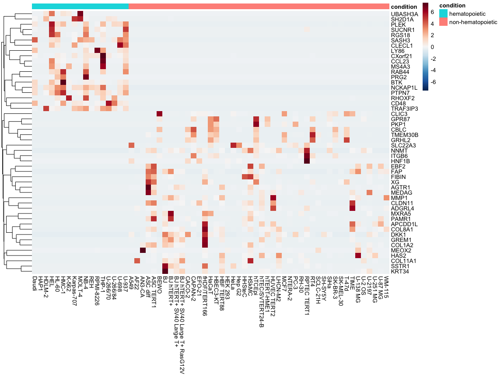
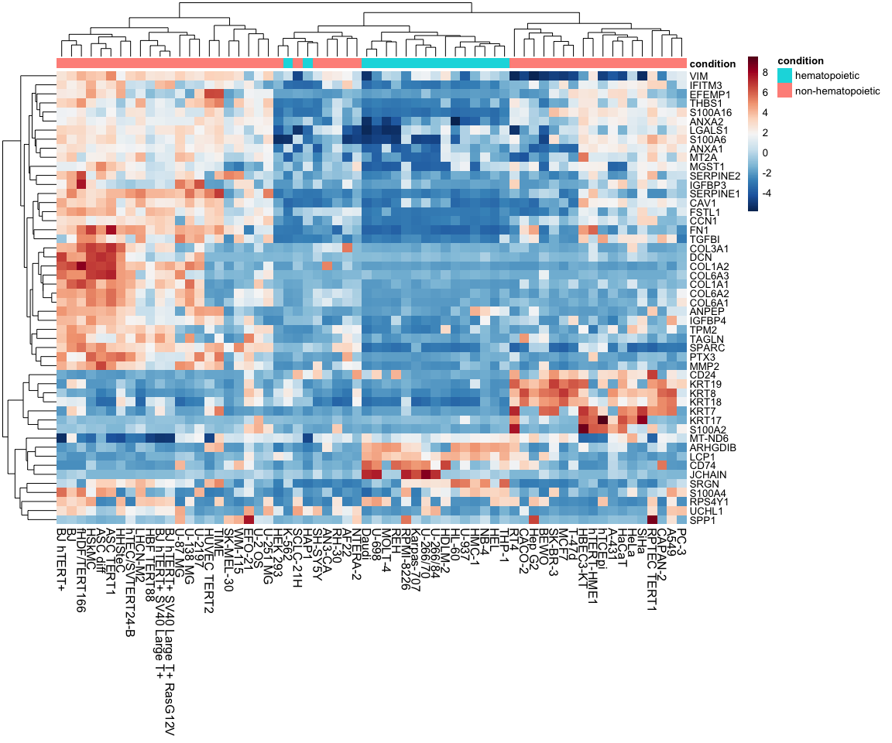
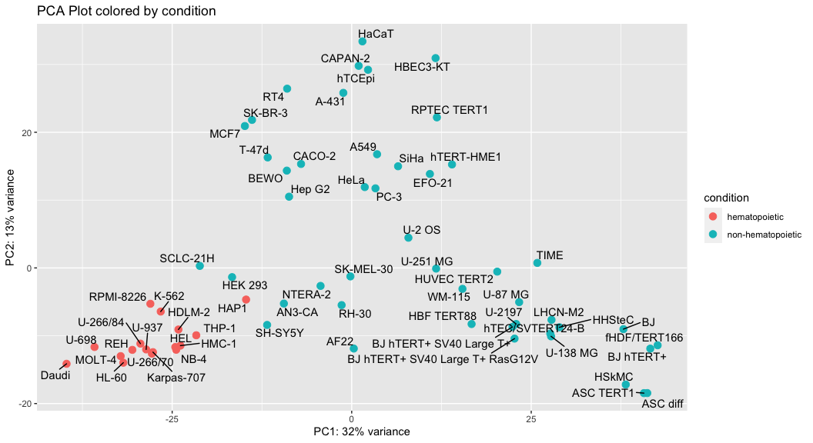
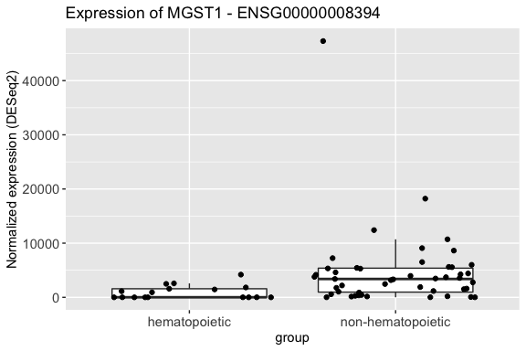
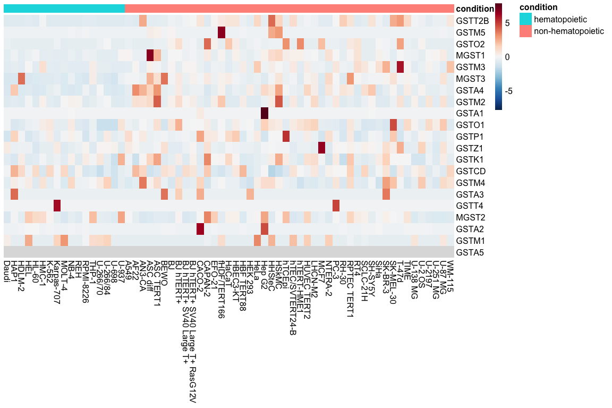
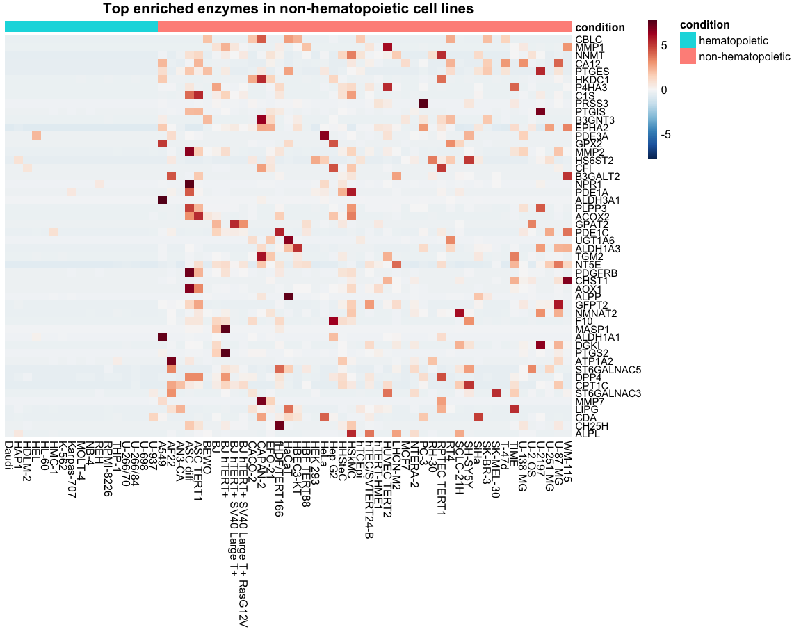

Cell Line Transcriptome Analysis Using R
================
Erick Lu

March 19, 2020

-   [Introduction](#introduction)
-   [Organizing the data](#organizing-the-data)
-   [Differential gene expression analysis](#differential-gene-expression-analysis)
-   [Visualizations](#visualizations)
    -   [Heatmap of differentially expressed genes](#heatmap-of-differentially-expressed-genes)
    -   [PCA plot to cluster cell lines](#pca-plot-to-cluster-cell-lines)
    -   [Volcano plot](#volcano-plot)
-   [Enzyme expression analysis](#enzyme-expression-analysis)
-   [Conclusion](#conclusion)

Introduction
------------

This project will show you how to identify differentially expressed genes between different groups of cell lines using RNA-seq data from The Human Protein Atlas. This is a useful dataset that can be used to characterize gene expression patterns specific to cells from different tissues of origin.

Here, I will take you through an analysis of hematopoietic vs non-hematopoietic cell lines, which includes:

1.  Organizing the data.
2.  Finding differentially expressed genes using DESeq2.
3.  Annotating, exporting, and plotting the results.

I performed this analysis in order to identify a set of enzymes that were enriched in non-hematopoietic cell lines. In the wet lab, I found that non-hematopoietic cell lines were secreting a molecule called geranylgeranyl-glutathione in greater amounts than hematopoietic cell lines. I wanted to figure out which enzymes could be responsible for producing the molecule, so I turned to this dataset to narrow down a list of candidate enzymes that were enriched in non-hematopoietic cells, which I could test in the lab.

For a more in-depth guide about how to perform bulk RNA-seq analysis, you can check out my bulk RNA-seq [guide](https://github.com/erilu/bulk-rnaseq-analysis).

Organizing the data
-------------------

The RNA-seq data for 64 human cell lines can be downloaded from the [Human Protein Atlas website](https://www.proteinatlas.org/about/download). Look under item 19, **RNA HPA cell line gene data**, and download `rna_celline.tsv.zip`. A copy of the data, `rna_celline.tsv`, is also included in this repository. A description of the cell lines can be found [here](https://www.proteinatlas.org/humanproteome/cell/cell+line).

Since the data are tab-delimited, we will first read in the data using `read.table` with the setting `sep=\t`.

``` r
data <- read.table("rna_celline.tsv", sep = "\t", header = T, stringsAsFactors = FALSE)
```

Taking a look at the data, we see that it is organized in the "long" format, with 1258880 rows and 6 columns:

``` r
dim(data)
```

    ## [1] 1258880       6

``` r
head(data)
```

    ##              Gene Gene.name Cell.line   TPM  pTPM   NX
    ## 1 ENSG00000000003    TSPAN6     A-431  27.8  33.9  7.8
    ## 2 ENSG00000000003    TSPAN6      A549  37.6  45.5 10.5
    ## 3 ENSG00000000003    TSPAN6      AF22 108.1 134.5 28.3
    ## 4 ENSG00000000003    TSPAN6    AN3-CA  51.8  64.4 14.3
    ## 5 ENSG00000000003    TSPAN6  ASC diff  32.3  37.4 12.4
    ## 6 ENSG00000000003    TSPAN6 ASC TERT1  17.7  20.8  6.7

For each of the 19670 genes, the expression values for each of the 64 cell lines are provided in consecutive rows. We can verify that there are equal representation of genes across cell lines by quickly counting using `group_by()` and `summarize()` from `dplyr`:

``` r
library(tidyverse)
data %>% group_by(Cell.line) %>% summarize (num_genes = n())
```

    ## # A tibble: 64 x 2
    ##    Cell.line               num_genes
    ##    <chr>                       <int>
    ##  1 A-431                       19670
    ##  2 A549                        19670
    ##  3 AF22                        19670
    ##  4 AN3-CA                      19670
    ##  5 ASC diff                    19670
    ##  6 ASC TERT1                   19670
    ##  7 BEWO                        19670
    ##  8 BJ                          19670
    ##  9 BJ hTERT+                   19670
    ## 10 BJ hTERT+ SV40 Large T+     19670
    ## # … with 54 more rows

For downstream analysis, the data needs to be reorganized into a different format. The RNA-seq analysis package [DESeq2](https://bioconductor.org/packages/release/bioc/html/DESeq2.html) from Bioconductor requires the data to be a matrix of expression values, in which the rows correspond to individual genes and the columns correspond to cell lines.

In order to create this matrix, I will use the `dcast()` function from the R package `reshape2`. This function will create a matrix using the column defined by the `value.var` argument, arranging its values according to a specified `formula`. In our case, we will set `value.var=TPM` and `formula=Gene~Cell.line`, which will make a matrix of TPM (transcripts per milllion) values.

``` r
tpm <- reshape2::dcast (data, Gene~Cell.line, value.var = "TPM")
tpm <- column_to_rownames(tpm, var = "Gene")
dim(tpm)
```

    ## [1] 19670    64

``` r
tpm[1:10,1:5]
```

    ##                 A-431  A549  AF22 AN3-CA ASC diff
    ## ENSG00000000003  27.8  37.6 108.1   51.8     32.3
    ## ENSG00000000005   0.0   0.0   0.0    0.0      0.5
    ## ENSG00000000419 120.0  49.7  81.8   46.0     48.3
    ## ENSG00000000457   3.6   4.7   7.8    5.1      6.8
    ## ENSG00000000460  28.5  15.6  21.9   10.5      2.4
    ## ENSG00000000938   0.0   0.0   0.3    0.0      0.3
    ## ENSG00000000971   0.0  57.4   0.0    0.0     65.0
    ## ENSG00000001036  85.7  50.9  47.6   81.5     47.9
    ## ENSG00000001084  27.3 185.8  16.3   36.3     13.3
    ## ENSG00000001167  28.5  23.8  48.6   76.6     13.6

The dimensions of the reorganized data should be 19670 rows and 64 columns, with rownames corresponding to the Ensembl IDs of each gene. I chose to use Ensembl IDs as unique gene identifiers instead of the gene names, because it appears that there are a small number of duplicate gene names in the dataset:

``` r
# of unique Ensembl IDs
length(unique(data$Gene))
```

    ## [1] 19670

``` r
# of unique gene names
length(unique(data$Gene.name))
```

    ## [1] 19651

Later on in the analysis, we will map the Ensembl IDs back to their gene names using an annotation file obtained from the BioMart at ensembl.org. Now that we have a data matrix of expression values in which each row is a gene and each column is a cell line, we can load this data into the R package DESeq2 to perform differential gene expression analysis.

Differential gene expression analysis
-------------------------------------

I will be using version 1.26.0 of DESeq2 for this analysis. This package provides a set of data normalization and processing tools for differential gene expression analysis.

``` r
library(DESeq2)
```

We will first categorize each cell line as either hematopoietic or non-hematopoietic. I used the information at <https://www.proteinatlas.org/learn/cellines> to identify cell lines from either myeloid or lymphoid origin:

``` r
hematopoietic <- c( "HEL","NB-4","HAP1","HL-60","HMC-1","K-562","THP-1","U-937",
            "REH","Daudi","HDLM-2","Karpas-707","MOLT-4","RPMI-8226","U-266/70","U-266/84","U-698")
condition <- ifelse( colnames(tpm) %in% hematopoietic, "hematopoietic", "non-hematopoietic")
colData <- as.data.frame(condition)
rownames(colData) <- colnames(tpm)
head(colData)
```

    ##                   condition
    ## A-431     non-hematopoietic
    ## A549      non-hematopoietic
    ## AF22      non-hematopoietic
    ## AN3-CA    non-hematopoietic
    ## ASC diff  non-hematopoietic
    ## ASC TERT1 non-hematopoietic

The data frame above has each of the cell lines labeled as "hematopoietic" vs "non-hematopoietic". We have to input this data frame and the raw expression data into the `DESeqDataSetFromMatrix()` function, which creates a DESeq2 object (usually named `dds`):

``` r
dds <- DESeqDataSetFromMatrix(countData = tpm*10,
                              colData = colData,
                              design = ~condition)
```

Then, we run the function `DESeq()` to process the data and compute the differentially expressed genes between groups:

``` r
dds <- DESeq(dds)
```

The results of the analysis can be extracted using the `results()` function on the `dds` object. The `contrast` argument specifies the two groups being compared:

``` r
results(dds, contrast = c("condition", "non-hematopoietic", "hematopoietic"))
```

    ## log2 fold change (MLE): condition hematopoietic vs non-hematopoietic
    ## Wald test p-value: condition hematopoietic vs non-hematopoietic
    ## DataFrame with 19670 rows and 6 columns

    ##                     baseMean log2FoldChange     lfcSE        stat       pvalue
    ## ENSG00000000003 287.48216108      5.5671632 0.4119266 13.51493950 1.276606e-41
    ## ENSG00000000005   0.09942444      0.2689355 3.3170785  0.08107603 9.353815e-01
    ## ENSG00000000419 834.21264480      0.1311804 0.1550139  0.84624911 3.974138e-01
    ## ENSG00000000457  58.15196473     -0.3832616 0.1440108 -2.66133835 7.783070e-03
    ## ENSG00000000460 158.29727584     -0.4768447 0.2447553 -1.94825035 5.138501e-02
    ## ENSG00000000938  41.11699294     -8.0702576 0.9967060 -8.09692915 5.636388e-16
    ##                         padj
    ## ENSG00000000003 7.916376e-39
    ## ENSG00000000005           NA
    ## ENSG00000000419 5.269580e-01
    ## ENSG00000000457 2.290192e-02
    ## ENSG00000000460 1.071295e-01
    ## ENSG00000000938 2.585481e-14

Because we are interested in genes which are significantly different between the two groups, we should filter the results for genes that have adjusted p-values below a certain threshold. We will also order the significant genes based on `log2FoldChange`, which allows us to view the genes which are most greatly up- or down-regulated between groups. For this comparison, higher `log2FoldChange` values mean a greater enrichment in non-hematopoietic cells.

We also need to annotate our results by mapping the Ensembl IDs back to their respective gene names. I do so by loading an annotation file that I created from the BioMart at ensembl.org. The function `generate_DE_results()` below will perform these filtering, ordering, and annotation steps, and write the processed results to csv files.

``` r
generate_DE_results <- function (dds, comparisons, padjcutoff = 0.001) {
  # extract DESeq results between the comparisons indicated
  res <- results(dds, contrast = c("condition", comparisons[1], comparisons[2]))[,-c(3,4)]

  # annotate the data with gene name
  res <- as_tibble(res, rownames = "ensembl_id")
  my_annotation <- read.csv("GRCh38.p13_annotation.csv", header = T, stringsAsFactors = F)
  res <- left_join(res, my_annotation, by = c("ensembl_id" = "Gene.stable.ID"))

  # combine normalized counts with entire DE list
  normalized_counts <- round(counts(dds, normalized = TRUE),3)
  combined_data <- as_tibble(cbind(res, normalized_counts))
  combined_data <- combined_data[order(combined_data$log2FoldChange, decreasing = T),]

  # generate sorted lists with the indicated cutoff values
  res <- res[order(res$log2FoldChange, decreasing=TRUE ),]
  de_genes_padj <- res[which(res$padj < padjcutoff),]

  # write output to files
  write.csv (de_genes_padj, file = paste0(comparisons[1], "_vs_", comparisons[2], "_padj_cutoff.csv"), row.names =F)
  write.csv (combined_data, file = paste0(comparisons[1], "_vs_", comparisons[2], "_allgenes.csv"), row.names =F)

  writeLines( paste0("For the comparison: ", comparisons[1], "_vs_", comparisons[2], "\n",
                     "Out of ", nrow(combined_data), " genes, ", nrow(de_genes_padj), " were below padj ", padjcutoff, "\n",
                     "Gene lists ordered by log2fchange have been generated.") )
}
```

After running the function, the console should display the number of significant genes under the specified p-value cutoff:

``` r
generate_DE_results (dds, c("non-hematopoietic", "hematopoietic"), padjcutoff = 0.001)
```

    ## For the comparison: non-hematopoietic_vs_hematopoietic
    ## Out of 19670 genes, 3353 were below padj 0.001
    ## Gene lists ordered by log2fchange have been generated.

The gene lists can be found in the `output/` folder of this repo. We can sift through these gene lists to see which genes are most differentially up or down in non-hematopoietic cell lines compared to hematopoietic cell lines. Positive `log2FoldChange` values mean the gene is up in non-hematopoetic cells, and vice versa.

Visualizations
--------------

### Heatmap of differentially expressed genes

A way to visualize the results from the csv files we generated is to plot the expression values for each gene in a heatmap. The heatmap below takes the top 50 significant genes ordered by the absolute value of the `log2FoldChange` value. It should display genes that are highly enriched in either the hematopoietic or non-hematopoietic lines.

``` r
res <- read.csv ("non-hematopoietic_vs_hematopoietic_allgenes.csv", header = T, check.names = F)
DE_gene_heatmap <- function(res, padj_cutoff = 0.001, ngenes = 20) {
  # generate the color palette
  brewer_palette <- "RdBu"
  ramp <- colorRampPalette(RColorBrewer::brewer.pal(11, brewer_palette))
  mr <- ramp(256)[256:1]
  # obtain the significant genes and order by log2FoldChange
  significant_genes <- res %>% filter(padj < padj_cutoff) %>% arrange (desc(abs(log2FoldChange))) %>% head (ngenes)
  heatmap_values <- as.matrix(significant_genes[,-c(1:8)])
  rownames(heatmap_values) <- significant_genes$Gene.name
  heatmap_values <- cbind (heatmap_values[,colnames(heatmap_values) %in% hematopoietic], heatmap_values[,!colnames(heatmap_values) %in% hematopoietic])
  # plot the heatmap using pheatmap
  pheatmap::pheatmap(heatmap_values, color = mr, scale = "row", annotation_col = colData, border_color = NA, cluster_cols = F)
}
DE_gene_heatmap(res, padj_cutoff = 0.01, ngenes = 50)
```



Another way of looking at differences in gene expression between groups of samples is to construct a heatmap displaying the top most variable genes. The code below will find the top most variable genes using the `rowVars()` function, and plot the results using `pheatmap()`.

``` r
variable_gene_heatmap <- function (dds, num_genes = 500) {
  vsd.obj <- vst(dds, blind = TRUE)
  brewer_palette <- "RdBu"
  # Ramp the color in order to get the scale.
  ramp <- colorRampPalette( RColorBrewer::brewer.pal(11, brewer_palette))
  mr <- ramp(256)[256:1]
  # get the stabilized counts from the vsd object
  stabilized_counts <- assay(vsd.obj)
  # calculate the variances by row(gene) to find out which genes are the most variable across the samples.
  row_variances <- rowVars(stabilized_counts)
  # get the top most variable genes
  top_variable_genes <- stabilized_counts[order(row_variances, decreasing=T)[1:num_genes],]
  # subtract out the means from each row, leaving the variances for each gene
  top_variable_genes <- top_variable_genes - rowMeans(top_variable_genes, na.rm=T)
  # replace the ensembl ids with the gene names
  annotation <- read.csv("GRCh38.p13_annotation.csv", header = T, stringsAsFactors = F)
  gene_names <- annotation$Gene.name[match(rownames(top_variable_genes), annotation$Gene.stable.ID)]
  rownames(top_variable_genes) <- gene_names
  # reconstruct colData without sizeFactors for heatmap labeling
  coldata <- as.data.frame(vsd.obj@colData)
  coldata$sizeFactor <- NULL
  coldata$replaceable <- NULL
  # draw heatmap using pheatmap
  pheatmap::pheatmap(top_variable_genes, color = mr, annotation_col = coldata, fontsize_col = 12, fontsize_row = 10, border_color = NA, fontsize = 10)
}

variable_gene_heatmap(dds, num_genes = 50)
```



We observe that the hematopoietic cell lines mainly cluster together in the center of the heatmap, and that there are two major clusters of non-hematopoietic cell lines to the left and right. The genes that define the hematopoietic cells include CD74, JCHAIN, and LCP1. The genes that define the non-hematopoietic cells appear to be a set of collagen-related genese (left), and keratin-related genes (right). Interestingly, MGST1 is an enzyme that appears to be enriched in a subset of the non-hematopoietic lines.

### PCA plot to cluster cell lines

We can also use a principal components analysis (PCA) plot to observe how the cell lines cluster. Cell lines with similar gene expression patterns are expected to cluster more closely together on this plot.

``` r
plot_PCA = function (dds) {
  vsd.obj <- vst(dds, blind = TRUE)
  pcaData <- plotPCA(vsd.obj,  intgroup = c("condition"), returnData = T)
  percentVar <- round(100 * attr(pcaData, "percentVar"))
  ggplot(pcaData, aes(PC1, PC2, color=condition)) +
    geom_point(size=3) +
    labs(x = paste0("PC1: ",percentVar[1],"% variance"),
         y = paste0("PC2: ",percentVar[2],"% variance"),
         title = "PCA Plot colored by condition") +
    ggrepel::geom_text_repel(aes(label = name), color = "black")
}
plot_PCA(dds)
```



We can observe that the hematopoietic cell lines cluster away from the non-hematopoietic cell lines in the PCA plot. This suggests that they have very distinct gene expression profiles. The spread between the non-hematopoietic lines is much greater than we see within the hematopoietic lines. Perhaps this is expected, because the non-hematopoietic lines have cells derived from vastly different tissues, such as brain and liver.

### Volcano plot

A volcano plot is another way to visualize differentially expressed genes between the two groups. Here, the genes on the left are enriched in the hematopoietic cells, and the genes on the right are enriched in the non-hematopoietic cells.

``` r
plot_volcano <- function (res, padj_cutoff, nlabel = 10, label.by = "padj"){
  # assign significance to results based on padj
  res <- mutate(res, significance=ifelse(res$padj<padj_cutoff, paste0("padj < ", padj_cutoff), paste0("padj > ", padj_cutoff)))
  res = res[!is.na(res$significance),]
  significant_genes <- res %>% filter(significance == paste0("padj < ", padj_cutoff))

  # get labels for the highest or lowest genes according to either padj or log2FoldChange
  if (label.by == "padj") {
    top_genes <- significant_genes %>% filter (log2FoldChange > 0) %>% arrange(padj) %>% head(nlabel)
    bottom_genes <- significant_genes %>% filter (log2FoldChange < 0) %>% arrange(padj) %>% head (nlabel)
  } else if (label.by == "log2FoldChange") {
    top_genes <- head(arrange(significant_genes, desc(log2FoldChange)),nlabel)
    bottom_genes <- head(arrange(significant_genes, log2FoldChange),nlabel)
  } else
    stop ("Invalid label.by argument. Choose either padj or log2FoldChange.")

  ggplot(res, aes(log2FoldChange, -log(padj))) +
    geom_point(aes(col=significance)) +
    scale_color_manual(values=c("red", "black")) +
    ggrepel::geom_text_repel(data=top_genes, aes(label=head(Gene.name,nlabel)), size = 3)+
    ggrepel::geom_text_repel(data=bottom_genes, aes(label=head(Gene.name,nlabel)), color = "#619CFF", size = 3)+
    labs ( x = "Log2FoldChange", y = "-(Log normalized p-value)")+
    geom_vline(xintercept = 0, linetype = "dotted")+
    theme_minimal()
}

plot_volcano(res, 0.01, nlabel = 20, label.by = "padj")
```


As expected, we observe that genes such as PTPRC (CD45) and P2RY8 are enriched in the hematopoietic cell lines.

Enzyme expression analysis
--------------------------

I was specifically interested in the expression of a class of enzymes called glutathione-S-transferases, or GSTs. We can extract a list of the gsts by using the `grep()` function for the pattern "GST":

``` r
gst <- res[grep("GST", res$Gene.name),]
gst[,c(1:3,5:6)]
```

    ##            ensembl_id     baseMean log2FoldChange         padj Gene.name
    ## 680   ENSG00000133433  101.7527887     4.63653890 9.817911e-11    GSTT2B
    ## 1079  ENSG00000134201    2.6209056     3.73858513 7.594112e-02     GSTM5
    ## 1973  ENSG00000065621   57.4022882     2.55815936 2.972794e-06     GSTO2
    ## 2261  ENSG00000008394 3670.5874972     2.28527571 6.875110e-04     MGST1
    ## 2983  ENSG00000134202  399.3378554     1.74468568 9.766974e-03     GSTM3
    ## 3230  ENSG00000143198 1164.0999113     1.59279843 2.599661e-08     MGST3
    ## 3246  ENSG00000170899  177.9088771     1.58569253 3.951869e-03     GSTA4
    ## 3876  ENSG00000213366  150.2224695     1.24794372 8.441146e-02     GSTM2
    ## 5413  ENSG00000243955    6.9836421     0.70168082 6.659475e-01     GSTA1
    ## 5569  ENSG00000148834 1664.9793824     0.66761433 7.221087e-02     GSTO1
    ## 6294  ENSG00000084207 7077.6679921     0.50906697 3.705837e-01     GSTP1
    ## 6627  ENSG00000100577  228.8891438     0.44916613 1.260122e-01     GSTZ1
    ## 7993  ENSG00000197448 1036.0328958     0.24418491 4.861049e-01     GSTK1
    ## 9884  ENSG00000138780  104.3896483     0.03084647 9.099894e-01     GSTCD
    ## 10117 ENSG00000168765  167.7205670     0.02087448 9.723340e-01     GSTM4
    ## 10483 ENSG00000174156    0.3342674    -0.01272680           NA     GSTA3
    ## 11800 ENSG00000276950    0.0326321    -0.14635246           NA     GSTT4
    ## 13358 ENSG00000085871  459.8431900    -0.30867710 6.361379e-01     MGST2
    ## 16267 ENSG00000244067    0.8632147    -0.79474547 5.925601e-01     GSTA2
    ## 17164 ENSG00000134184  125.8777579    -1.17763783 2.651508e-01     GSTM1
    ## 19279 ENSG00000182793    0.0000000             NA           NA     GSTA5

Looking at the `log2foldchange` values, we see that GSTT2B, GSTM5, GST02, MGST1, and GSTM3 are the top 5 GSTs that are higher in non-hematopoietic cell lines compared to hematopoietic cell lines. We can plot individual graphs for genes of interest to see the extent of enrichment:

``` r
plot_counts <- function (dds, gene){
  annotation <- read.csv("GRCh38.p13_annotation.csv", header = T, stringsAsFactors = F)
  normalized_data <- counts(dds, normalized = T)
  condition <- dds@colData$condition
  # get the gene name from the ensembl id
  if (gene %in% annotation$Gene.name){ # check if a gene name is supplied
    ensembl_id <- annotation$Gene.stable.ID[which(annotation$Gene.name == gene)]
  } else if (gene %in% annotation$Gene.stable.ID){
    ensembl_id <- gene
  } else {
    stop("Gene not found. Check spelling.")
  }
  expression <- normalized_data[ensembl_id,]
  gene_name <- annotation$Gene.name[which(annotation$Gene.stable.ID == ensembl_id)]
  gene_tib <- tibble(condition = condition, expression = expression)
  ggplot(gene_tib, aes(x = condition, y = expression))+
    geom_boxplot(outlier.shape = NA)+
    geom_jitter()+
    labs (title = paste0("Expression of ", gene_name, " - ", ensembl_id),
          x = "group", y = paste0("Normalized expression (DESeq2)"))+
    theme(axis.text.x = element_text(size = 11), axis.text.y = element_text(size = 11))
}
plot_counts(dds, "MGST1")
```



We see that the distribution of expression for non-hematopoietic cells is skewed upwards by a small number of samples. The majority of other cell lines appear to have moderate expression of the enzyme. We can also plot the expression values for each GST in a heatmap, in order to better visualize the variability in expression for each individual cell line:



In order to get a more holistic, unbiased list of enzymes, we can filter our differential expression analysis results for only the genes that encode enzymes. To do so, we can annotate which genes encode enzymes using the `AnnotationDbi` package:

``` r
library("AnnotationDbi")
library("org.Hs.eg.db")

res$enzyme <- mapIds(org.Hs.eg.db,
                    keys=as.character(res$ensembl_id),
                    column="ENZYME",
                    keytype="ENSEMBL",
                    multiVals="first")
```

The `mapIds()` function above will apply the KEGG enzyme information to all the genes in the dataset. If the gene does not encode an enzyme, the value will be "NA". We can use this to our advantage to filter out non-enzyme encoding genes:

``` r
res_enzyme <- res[which(!is.na(res$enzyme)),]
dim(res_enzyme)
```

    ## [1] 2224   72

This leaves us with 2224 enzymes! I can then sort the results table based on Log2FoldChange values to find the enzymes which are most enriched in non-hematopoietic cells, and display the results using a heatmap:



Although these enzymes appear restricted to non-hematopoietic cell lines, the expression of these enzymes are highly variable and spotty. There does not seem to be an enzyme that is uniformly expressed at a high level across all non-hematopoietic cell lines. Nevertheless, I can use these lists of enzymes and GSTs as a starting point for my lab experiments.

Conclusion
----------

Here, I've shown you how to perform differential gene expression analysis on the cell atlas dataset from the Human Protein Atlas. I compared hematopoietic and non-hematopoietic cell lines with the goal of finding a list of enzymes enriched in non-hematopoietic cells. My hope is that others will be able to work off of my analysis to compare different groups of cell lines for their own research projects.

If you are interested in a more in-depth look at how to perform RNA-seq analysis, you can check out my bulk RNA-seq analysis [guide](https://github.com/erilu/bulk-rnaseq-analysis) where I provide step-by-step examples of how to download raw FASTQ sequencing files, align them to a reference genome, and use DESeq2 to find differentially expressed genes. Thanks for reading!
